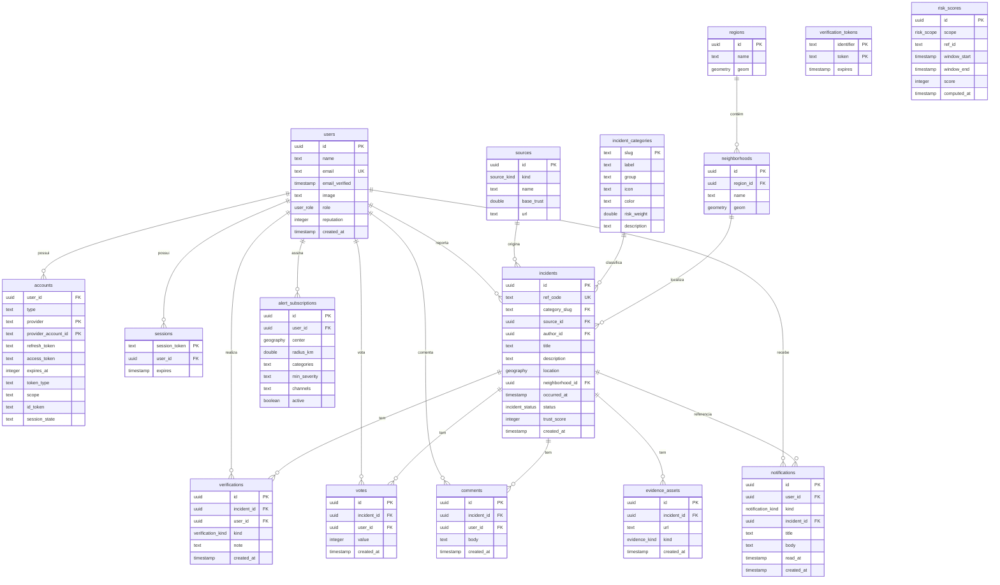

# Arquitetura do banco de dados

## Visão geral

O Radar Urbano usa **PostgreSQL 16** com a extensão **PostGIS 3.4** (imagem Docker `postgis/postgis:16-3.4`). O schema é gerenciado via **Drizzle ORM** com migrações SQL versionadas em `packages/db/drizzle/`. São 16 tabelas no total, divididas em grupos funcionais.

**SRID:** todas as colunas geoespaciais usam **SRID 4326** (WGS84 — latitude/longitude decimais).
**Índices GiST:** criados em todas as colunas `geography` e `geometry` para buscas espaciais eficientes.

---

## Diagrama ER



---

## Descrição das tabelas

### Grupo: Autenticação (Auth.js)

| Tabela                | Descrição                                                                                            |
| --------------------- | ---------------------------------------------------------------------------------------------------- |
| `users`               | Usuários do sistema. `reputation` (0–100) alimenta o fator A do Trust Score.                         |
| `accounts`            | Provedores OAuth vinculados ao usuário (ex.: GitHub). PK composta `(provider, provider_account_id)`. |
| `sessions`            | Sessões ativas. Auth.js gerencia o ciclo de vida.                                                    |
| `verification_tokens` | Tokens de verificação de e-mail. PK composta `(identifier, token)`.                                  |

### Grupo: Fontes e categorias

| Tabela                | Descrição                                                                                       |
| --------------------- | ----------------------------------------------------------------------------------------------- |
| `sources`             | Origens de dados: `OFFICIAL`, `COMMUNITY`, `NEWS`, `PARTNER`. `base_trust` serve como fallback. |
| `incident_categories` | 19 categorias com slug (PK), label, grupo, ícone Lucide, cor hex, `risk_weight` (0–1).          |

### Grupo: Geografia

| Tabela          | Descrição                                                                          |
| --------------- | ---------------------------------------------------------------------------------- |
| `regions`       | Regiões administrativas. `geom`: `geometry(MultiPolygon,4326)` + índice GiST.      |
| `neighborhoods` | Bairros vinculados a regiões. `geom`: `geometry(MultiPolygon,4326)` + índice GiST. |

### Grupo: Incidentes

| Tabela            | Descrição                                                                                                                                                                            |
| ----------------- | ------------------------------------------------------------------------------------------------------------------------------------------------------------------------------------ |
| `incidents`       | Registro central. `ref_code` segue o padrão `RU-NNNN`. `location`: `geography(Point,4326)` + GiST. `trust_score` inteiro 0–100. Status: `PENDING → CONFIRMED / REJECTED → RESOLVED`. |
| `verifications`   | CONFIRM ou DISPUTE por usuário. Alimenta o fator C do Trust Score.                                                                                                                   |
| `votes`           | Votos numéricos (positivo/negativo) em incidentes.                                                                                                                                   |
| `comments`        | Comentários textuais. Cascata `onDelete` quando o incidente é removido.                                                                                                              |
| `evidence_assets` | Fotos (`IMAGE`) ou vídeos (`VIDEO`) anexados. Alimentam o fator E do Trust Score.                                                                                                    |

### Grupo: Risco

| Tabela        | Descrição                                                                                                                                   |
| ------------- | ------------------------------------------------------------------------------------------------------------------------------------------- |
| `risk_scores` | Snapshots append-only de risco por escopo (`STREET`, `NEIGHBORHOOD`, `REGION`). `ref_id` identifica a entidade geográfica. Ver nota abaixo. |

### Grupo: Alertas e notificações

| Tabela                | Descrição                                                                                                                                                                                  |
| --------------------- | ------------------------------------------------------------------------------------------------------------------------------------------------------------------------------------------ |
| `alert_subscriptions` | Assinaturas de alerta por área (`center` + `radius_km`). Filtros por categoria e severidade mínima. Canais: `IN_APP` (padrão), outros via array. `center`: `geography(Point,4326)` + GiST. |
| `notifications`       | Notificações entregues ao usuário. `read_at` nulo = não lida.                                                                                                                              |

---

## Enums PostgreSQL

| Enum                | Valores                                                       |
| ------------------- | ------------------------------------------------------------- |
| `source_kind`       | `OFFICIAL`, `COMMUNITY`, `NEWS`, `PARTNER`                    |
| `incident_status`   | `PENDING`, `CONFIRMED`, `REJECTED`, `RESOLVED`                |
| `user_role`         | `USER`, `MODERATOR`, `ADMIN`                                  |
| `verification_kind` | `CONFIRM`, `DISPUTE`                                          |
| `evidence_kind`     | `IMAGE`, `VIDEO`                                              |
| `risk_scope`        | `STREET`, `NEIGHBORHOOD`, `REGION`                            |
| `notification_kind` | `CRITICAL`, `ATTENTION`, `VERIFIED`, `CONFIRMATION`, `DIGEST` |

---

## Nota: `risk_scores` é append-only

A tabela `risk_scores` **não usa upsert**. Cada execução do worker insere novos registros. Consumidores leem o score mais recente via:

```sql
SELECT DISTINCT ON (ref_id) *
FROM risk_scores
WHERE scope = 'NEIGHBORHOOD'
ORDER BY ref_id, computed_at DESC;
```

Retenção e limpeza de registros antigos são **trabalho futuro** — nenhuma política de expiração automática está implementada.

---

## Nota: migrações manuais (drizzle-kit + PostGIS)

O `drizzle-kit` não reconhece `geography` como tipo nativo do PostgreSQL. Ao executar `drizzle-kit generate`, ele emite o tipo entre aspas duplas:

```sql
-- INCORRETO (gerado automaticamente):
"geography(Point,4326)"

-- CORRETO (após correção manual):
geography(Point,4326)
```

**A migração em `packages/db/drizzle/` foi corrigida manualmente** e contém um cabeçalho `NOTE` documentando isso. **Nunca delete e regenere a migração sem aplicar essa correção**; o SQL com aspas é inválido e falhará no PostgreSQL.

Se for necessário regenerar:

1. Execute `pnpm --filter @radar-urbano/db generate`.
2. Abra o arquivo `.sql` gerado.
3. Substitua todas as ocorrências de `"geography(Point,4326)"` por `geography(Point,4326)` e `"geography(Polygon,4326)"` pelo equivalente sem aspas.
4. Valide o SQL antes de aplicar.
